<div align="center">

# 🤖 A.U.R.A. 
**Autonomous Universal Research Agent**

[](https://www.python.org/downloads/release/python-3100/)
[](https://opensource.org/licenses/MIT)
[](http://makeapullrequest.com)

An **autonomous AI agent** that thinks, plans, researches, reflects, and generates comprehensive architectural reports — all on its own. Built from the ground up prioritizing **Flow Engineering over bloated frameworks**.

[Features](#-features) • [Quick Start](#-quick-start) • [Architecture](#%EF%B8%8F-architecture) • [The Philosophy](#-the-philosophy-under-the-hood)

</div>

---

## 🎯 What is A.U.R.A.?

Most AI research tools are simply wrappers around a single prompt. A.U.R.A. is different. It's an **autonomous state machine** that mimics a human researcher:

1.  **PLAN:** Break a complex goal into 3-8 specific, actionable web queries.
2.  **RESEARCH:** Search the web (DuckDuckGo + Google RSS fallback), scrape actual web pages, and extract meaningful data.
3.  **REFLECT:** Pause and grade its own findings (Completeness & Depth). If the research isn't good enough, it automatically generates *new* queries and loops back.
4.  **REPORT:** Synthesize everything into a deeply technical, well-structured Markdown document.

## ✨ Features

- **No LangChain. No AutoGen.** Built purely on a robust `while` loop and Python first-principles for 100% transparency.
- **Multi-Provider LLM Support:**
  - 🖥️ **Ollama** (Run locally for FREE — e.g., llama3, phi3, gemma2)
  - 🟢 **OpenAI** (GPT-4o, GPT-4o-mini)
  - 🟣 **Anthropic** (Claude 3.5 Sonnet, Claude 3 Opus)
  - 🔵 **Google** (Gemini 2.0 Flash)
- **Automatic "Compact" Mode:** Automatically detects small < 4B parameter models (like `phi3` or `gemma2:2b`) and drastically optimizes prompts, scrape payloads, and expected output lengths to prevent CPU timeouts.
- **Robust Parsing:** Small models fail at JSON. A.U.R.A. uses line-oriented text parsing with Regex fallbacks, making it virtually crash-proof.
- **Beautiful Real-time UI:** Watch the agent "think" via a dark-mode Web UI powered by Server-Sent Events (SSE) that won't timeout your browser.

---

## 🚀 Quick Start

### 1. Installation

Clone the repository and install the lightweight dependencies:

```bash
git clone https://github.com/shanmukhkoya/A.U.R.A.git
cd A.U.R.A

# Create a virtual environment
python -m venv venv
venv\Scripts\activate        # Windows
# source venv/bin/activate   # Mac/Linux

# Install requirements
pip install -r requirements.txt
```

### 2. Configuration

Copy the environment template if you plan to use cloud providers (OpenAI, Anthropic, Google):

```bash
cp .env.example .env
# Edit .env and add your API keys
```

Edit `config.yaml` to set your desired LLM provider, model, and research depth (`quick`, `detailed`, `exhaustive`).

```yaml
provider: ollama
ollama:
  model: llama3
```

### 3. Run the Agent

**Via the Web UI (Recommended for visualization):**
```bash
python web/server.py
```
*Open `http://localhost:5000` in your browser.*

**Via the CLI:**
```bash
# Interactive mode
python run.py

# Direct command
python run.py "Design a CCaaS migration plan from Avaya to Genesys Cloud"

# Override provider/model on the fly
python run.py --provider openai --model gpt-4o "Compare SIP trunk providers"
```

---

## 🏗️ Architecture overview

```mermaid
graph TD;
    USER[User Input] --> PLAN[📝 Planner: Break into search tasks];
    PLAN --> EXEC_SEARCH[🔍 Executor: DuckDuckGo Search];
    EXEC_SEARCH --> EXEC_SCRAPE[📄 Executor: Scrape HTML text];
    EXEC_SCRAPE --> EXEC_ANALYZE[🧠 Executor: LLM analysis];
    
    EXEC_ANALYZE --> REFLECT[🤔 Reflector: Quality evaluation];
    
    REFLECT -- "Score < 8/10 (MORE Tasks)" --> EXEC_SEARCH;
    REFLECT -- "Score > 8/10 (SUFFICIENT)" --> REPORT[📑 Synthesizer: Final Markdown Report];
```



A.U.R.A. decouples the **Flask Web Server** from the **Agent Thread** using a background daemon and `queue.Queue()`. The frontend hooks into an `/api/stream` endpoint, reading Server-Sent Events (SSE) to paint the agent's real-time thoughts without HTTP timeout constraints.

---

## 🧠 The Philosophy (Under the Hood)

If you're interested in the deep technical decisions behind A.U.R.A., read the [ARCHITECTURAL_LEARNINGS.md](ARCHITECTURAL_LEARNINGS.md) document. It covers:
1. **Flow Engineering over Frameworks:** Why we ditched LangChain.
2. **The Economics of Token Budgets:** How we got a 3.8B model running locally on a CPU without timing out.
3. **Robust Prompt Engineering:** Why forcing LLMs to output strict JSON is a trap, and how Regex saves the day.
4. **Tool Resilience:** Gracefully handling paywalls and Cloudflare blocks.

---

## 🤝 Contributing

Contributions are what make the open-source community such an amazing place to learn, inspire, and create. Any contributions you make are **greatly appreciated**.

1. Fork the Project
2. Create your Feature Branch (`git checkout -b feature/AmazingFeature`)
3. Commit your Changes (`git commit -m 'Add some AmazingFeature'`)
4. Push to the Branch (`git push origin feature/AmazingFeature`)
5. Open a Pull Request

---

## 📄 License

Distributed under the MIT License. See `LICENSE` for more information. (You may need to quickly add a LICENSE file!)
